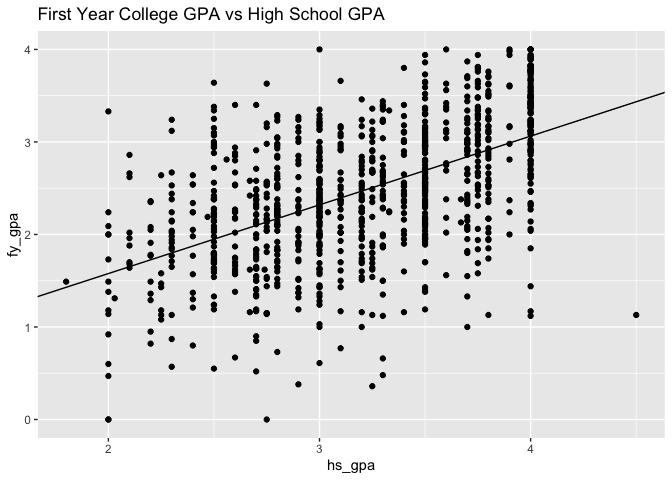
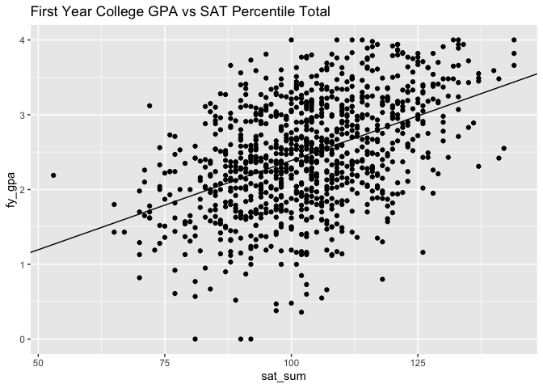
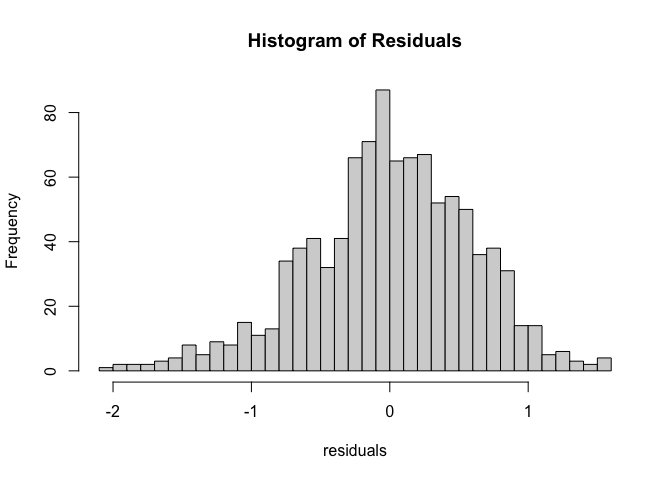
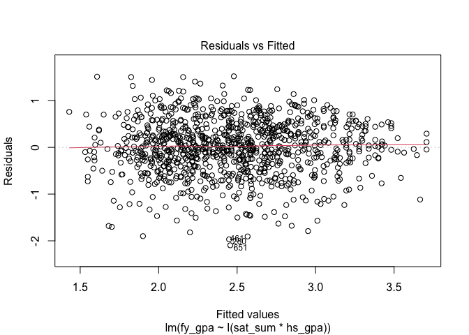
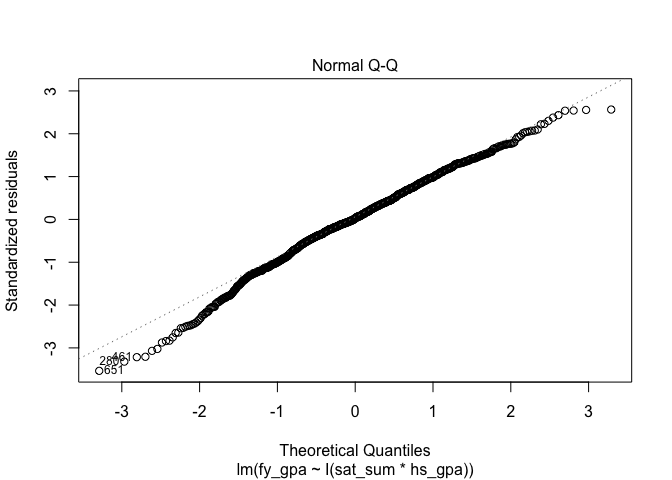
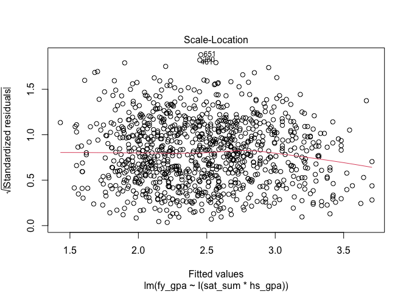
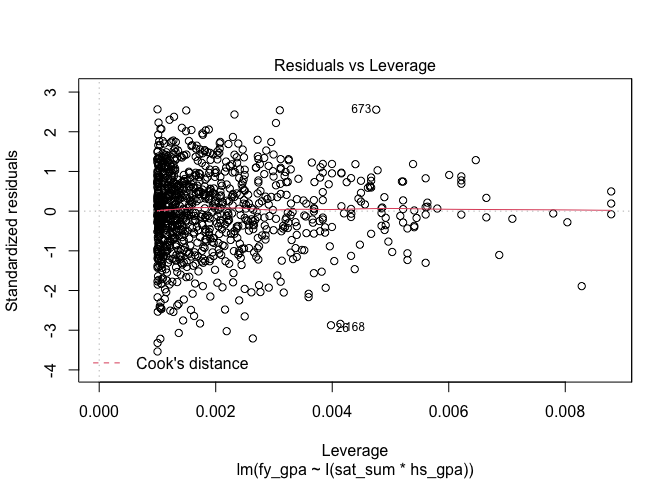

# Overview

This project aims to examine the connection between high school academic
performance and subsequent college success among a sample of 1000
students from an undisclosed college. The overall hypothesis is that
students who excel in high school continue to excel academically in
college. To examine this hypothesis, an array of statistical tests and
analyses have been conducted on the data set, aiming to generate
substantial evidence to either support or reject the null and alternate
hypotheses.

**Null Hypothesis (Ho): There is no significant relationship between
high school performance (measured by SAT percentile and high school GPA)
and college success (measured by first-year college GPA).**

**Alternate Hypothesis (Ha): There is a significant relationship between
high school performance (measured by SAT percentile and high school GPA)
and college success (measured by first-year college GPA).**

# Data

    sg = read.csv("satgpa_data.csv")
    head(sg)

    ##   sex sat_v sat_m sat_sum hs_gpa fy_gpa
    ## 1   1    65    62     127   3.40   3.18
    ## 2   2    58    64     122   4.00   3.33
    ## 3   2    56    60     116   3.75   3.25
    ## 4   1    42    53      95   3.75   2.42
    ## 5   1    55    52     107   4.00   2.63
    ## 6   2    55    56     111   4.00   2.91

# Analysis

    lm_1 = lm(fy_gpa ~ hs_gpa, data = sg)
    summary(lm_1)

    ## 
    ## Call:
    ## lm(formula = fy_gpa ~ hs_gpa, data = sg)
    ## 
    ## Residuals:
    ##      Min       1Q   Median       3Q      Max 
    ## -2.30544 -0.37417  0.03936  0.41912  1.75240 
    ## 
    ## Coefficients:
    ##             Estimate Std. Error t value Pr(>|t|)    
    ## (Intercept)  0.09132    0.11789   0.775    0.439    
    ## hs_gpa       0.74314    0.03635  20.447   <2e-16 ***
    ## ---
    ## Signif. codes:  0 '***' 0.001 '**' 0.01 '*' 0.05 '.' 0.1 ' ' 1
    ## 
    ## Residual standard error: 0.6222 on 998 degrees of freedom
    ## Multiple R-squared:  0.2952, Adjusted R-squared:  0.2945 
    ## F-statistic: 418.1 on 1 and 998 DF,  p-value: < 2.2e-16

    cor(x = sg$hs_gpa,y = sg$fy_gpa)

    ## [1] 0.5433535

    ggplot(data = sg, aes(x = hs_gpa, y = fy_gpa)) + geom_point() + geom_abline(intercept = 0.09132,slope = 0.74314) + labs(title = "First Year College GPA vs High School GPA")

fy\_gpa = 0.74314 \* hs\_gpa + 0.9132 First year college GPA (fy\_gpa)
is modeled 0.74314\*hs\_gpa+0.9132. This implies that the intercept
(when high school GPA is 0) is 0.9132, and for every one unit increase
in high school GPA (hs\_gpa) the first year college GPA is expected to
increase by 0.74314.

    lm_2 = lm(fy_gpa ~ sat_sum, data = sg)
    summary(lm_2)

    ## 
    ## Call:
    ## lm(formula = fy_gpa ~ sat_sum, data = sg)
    ## 
    ## Residuals:
    ##     Min      1Q  Median      3Q     Max 
    ## -2.1976 -0.4495  0.0315  0.4557  1.6115 
    ## 
    ## Coefficients:
    ##             Estimate Std. Error t value Pr(>|t|)    
    ## (Intercept) 0.001927   0.151991   0.013     0.99    
    ## sat_sum     0.023866   0.001457  16.379   <2e-16 ***
    ## ---
    ## Signif. codes:  0 '***' 0.001 '**' 0.01 '*' 0.05 '.' 0.1 ' ' 1
    ## 
    ## Residual standard error: 0.658 on 998 degrees of freedom
    ## Multiple R-squared:  0.2119, Adjusted R-squared:  0.2111 
    ## F-statistic: 268.3 on 1 and 998 DF,  p-value: < 2.2e-16

    cor(x = sg$sat_sum,y = sg$fy_gpa)

    ## [1] 0.460281

    ggplot(data = sg, aes(x = sat_sum, y = fy_gpa)) + geom_point() + geom_abline(intercept = 0.001927, slope = 0.023866 ) + labs(title = "First Year College GPA vs SAT Percentile Total")

fy\_gpa = 0.023866 \* sat\_sum + 0.001927 First year college GPA
(fy\_gpa) is modeled 0.023866\*sat\_sum+0.001927. This implies that the
intercept (when sat sum is 0) is 0.001927, and for every one unit
increase in sat sum the first year college GPA is expected to increase
by 0.023866.

## Model 1

    mod1 = lm(fy_gpa ~ sat_sum + hs_gpa, data = sg)
    summary(mod1)

    ## 
    ## Call:
    ## lm(formula = fy_gpa ~ sat_sum + hs_gpa, data = sg)
    ## 
    ## Residuals:
    ##      Min       1Q   Median       3Q      Max 
    ## -2.11889 -0.34126  0.02434  0.40953  1.62368 
    ## 
    ## Coefficients:
    ##              Estimate Std. Error t value Pr(>|t|)    
    ## (Intercept) -0.873433   0.149028  -5.861 6.25e-09 ***
    ## sat_sum      0.014402   0.001458   9.878  < 2e-16 ***
    ## hs_gpa       0.579489   0.038456  15.069  < 2e-16 ***
    ## ---
    ## Signif. codes:  0 '***' 0.001 '**' 0.01 '*' 0.05 '.' 0.1 ' ' 1
    ## 
    ## Residual standard error: 0.5941 on 997 degrees of freedom
    ## Multiple R-squared:  0.3581, Adjusted R-squared:  0.3568 
    ## F-statistic: 278.1 on 2 and 997 DF,  p-value: < 2.2e-16

    cor(x= sg$sat_sum+sg$hs_gpa, y = sg$fy_gpa)

    ## [1] 0.4728849

## Model 2

    mod2 = lm(fy_gpa ~ sat_sum+hs_gpa+I(sat_sum*hs_gpa), data = sg)
    summary(mod2)

    ## 
    ## Call:
    ## lm(formula = fy_gpa ~ sat_sum + hs_gpa + I(sat_sum * hs_gpa), 
    ##     data = sg)
    ## 
    ## Residuals:
    ##      Min       1Q   Median       3Q      Max 
    ## -2.10116 -0.33940  0.01683  0.41035  1.56987 
    ## 
    ## Coefficients:
    ##                      Estimate Std. Error t value Pr(>|t|)  
    ## (Intercept)          0.875881   0.792732   1.105   0.2695  
    ## sat_sum             -0.002729   0.007763  -0.352   0.7253  
    ## hs_gpa               0.032836   0.246334   0.133   0.8940  
    ## I(sat_sum * hs_gpa)  0.005300   0.002359   2.247   0.0249 *
    ## ---
    ## Signif. codes:  0 '***' 0.001 '**' 0.01 '*' 0.05 '.' 0.1 ' ' 1
    ## 
    ## Residual standard error: 0.5929 on 996 degrees of freedom
    ## Multiple R-squared:  0.3613, Adjusted R-squared:  0.3594 
    ## F-statistic: 187.8 on 3 and 996 DF,  p-value: < 2.2e-16

    cor(sg$sat_sum+sg$hs_gpa+I(sg$sat_sum*sg$hs_gpa), y = sg$fy_gpa)

    ## [1] 0.5941082

The interaction term of high school GPA and sat sum is the only
significant predictor in this model.

## Model 3

    mod3 = lm(fy_gpa ~ I(sat_sum * hs_gpa), data = sg)
    summary(mod3)

    ## 
    ## Call:
    ## lm(formula = fy_gpa ~ I(sat_sum * hs_gpa), data = sg)
    ## 
    ## Residuals:
    ##      Min       1Q   Median       3Q      Max 
    ## -2.09625 -0.33768  0.01615  0.40815  1.52073 
    ## 
    ## Coefficients:
    ##                      Estimate Std. Error t value Pr(>|t|)    
    ## (Intercept)         0.7605230  0.0745388   10.20   <2e-16 ***
    ## I(sat_sum * hs_gpa) 0.0051153  0.0002161   23.67   <2e-16 ***
    ## ---
    ## Signif. codes:  0 '***' 0.001 '**' 0.01 '*' 0.05 '.' 0.1 ' ' 1
    ## 
    ## Residual standard error: 0.5932 on 998 degrees of freedom
    ## Multiple R-squared:  0.3595, Adjusted R-squared:  0.3589 
    ## F-statistic: 560.2 on 1 and 998 DF,  p-value: < 2.2e-16

    cor(x = I(sg$sat_sum * sg$hs_gpa), y = sg$fy_gpa)

    ## [1] 0.5995926

## Assumptions

    hist(mod3$residuals, breaks = 30,
         xlab = "residuals",
         main = "Histogram of Residuals")

    res = resid(mod3)
    plot(mod3)

    durbinWatsonTest(mod3)

    ##  lag Autocorrelation D-W Statistic p-value
    ##    1     -0.01142755      2.022409   0.718
    ##  Alternative hypothesis: rho != 0

    cooks3 = cooks.distance(mod3)
    influential3 = cooks3[(cooks3 > (3 * mean(cooks3)))]
    num3 = length(influential3)
    num3

    ## [1] 79

    non_influential = which(!(1:length(cooks3) %in% influential3))
    data_without_outliers = sg[non_influential, ]
    mod4 = lm(fy_gpa ~ I(sat_sum * hs_gpa), data = data_without_outliers)
    summary(mod4)

    ## 
    ## Call:
    ## lm(formula = fy_gpa ~ I(sat_sum * hs_gpa), data = data_without_outliers)
    ## 
    ## Residuals:
    ##      Min       1Q   Median       3Q      Max 
    ## -2.09625 -0.33768  0.01615  0.40815  1.52073 
    ## 
    ## Coefficients:
    ##                      Estimate Std. Error t value Pr(>|t|)    
    ## (Intercept)         0.7605230  0.0745388   10.20   <2e-16 ***
    ## I(sat_sum * hs_gpa) 0.0051153  0.0002161   23.67   <2e-16 ***
    ## ---
    ## Signif. codes:  0 '***' 0.001 '**' 0.01 '*' 0.05 '.' 0.1 ' ' 1
    ## 
    ## Residual standard error: 0.5932 on 998 degrees of freedom
    ## Multiple R-squared:  0.3595, Adjusted R-squared:  0.3589 
    ## F-statistic: 560.2 on 1 and 998 DF,  p-value: < 2.2e-16

95% Confidence for Model 3

    beta_0 = 0.0051153    
    SE = 0.0002161
    qmin = qt(.025,df=998)
    qmax = (qt(1-.025,df=998))
    beta_0 + qmax*SE

    ## [1] 0.005539363

    beta_0 + qmin*SE

    ## [1] 0.004691237

(0.004691237,0.005539363)

# Results

Among the three models, Model 3 emerges as the preferred choice. The
decision to build Model 3 was influenced by the significance of the
interaction term observed in Models 1 and 2. Despite the adjusted
R-squared values and residual standard error being comparable throughout
the models, Model 3 stands out with a higher F-statistic and correlation
coefficient. Model 3 is a simpler model because it contains fewer
predictors. It demonstrates statistical significance, but also presents
a greater overall fit to the data.

After deciding model 3 was the best fit it needed to be tested against
the assumptions.

1.  Linearity: The presence of a linear relationship between each
    independent variable and the dependent variable was examined through
    scatter plots, focusing on the relationships between high school GPA
    and first-year college GPA, as well as SAT sum percentiles and
    first-year college GPA.

2.  Normality of Residuals: The normality of residuals was evaluated
    using a histogram and a Q-Q plot. This allowed for an assessment of
    whether the residuals approximated a normal distribution.

3.  Homoscedasticity: To ensure equal or similar variance in residuals,
    a Residuals vs. Fitted plot was examined. This visual inspection
    aimed to identify patterns in the spread of residuals across the
    range of fitted values.

4.  Independence: The Durbin-Watson Test was utilized to evaluate the
    residuals’ independence. This test offered insights into whether
    autocorrelation might be present in the residuals.

5.  Outliers or High Influential points: Exploration for potential
    outliers or highly influential points was analyzed through a
    Residuals vs. Leverage Plot. Additionally, Cook’s distance formula
    was applied to identify them. With 7.9% of the data points being
    outliers meant accessing their influence on the model. With removing
    the points from the linear model no influence was found.

These tests collectively contributed to a comprehensive evaluation of
the validity of Model 3.

For the interaction term ‘I(sat\_sum \* hs\_gpa)’ in the regression
model predicting first-year college GPA, the estimated coefficient is
0.0051 (95% CI: 0.0047, 0.0055). This suggests that, with 95%
confidence, the true effect of the interaction between SAT percentile
and high school GPA on first-year college GPA falls within the range of
0.0047 to 0.0055.

# Conclusion

**Null Hypothesis (Ho): There is no significant relationship between
high school performance (measured by SAT percentiles and high school
GPAs) and college success (measured by first-year college GPAs).**

**Alternate Hypothesis (Ha): There is a significant relationship between
high school performance (measured by SAT percentiles and high school
GPAs) and college success (measured by first-year college GPAs).**

**Based on the analysis conducted there is strong evidence to support
the alternate hypothesis that there is a significant relationship
between high school performance (measured by SAT percentiles and high
school GPAs) and college success (measured by first-year college
GPAs).** The key findings and evidence are summarized below:

The analysis, focusing on Model 3 as the preferred model implies that
there is a significant relationship between high school performance
(measured by SAT percentiles and high school GPAs) and college success
(measured by first-year college GPAs). Model 3 was chosen as the
preferred model due to the significance of the interaction term in Model
2 and it’s simplicity. Despite having comparable adjusted R-squared
values and residual standard errors across all models, Model 3 stood out
with a higher F-statistic and correlation coefficient, indicating a more
overall fit. The assumption testing included testing for linearity by
examining scatter plots, examining a histogram and a Q-Q plot to
determine if residuals were nearly normal, residuals vs fitted plot to
assess homoscedasticity, independence validations through the
Durbin-Watson test, and the identification of outliers through a
Residuals vs. Leverage and Cook’s Distance Formula. All findings
contributed to the validation of model 3. As a result the evidence from
the analysis supports the existence of a significant relationship
between high school performance and college success. The null hypothesis
(Ho) of no significant relationship is rejected in favor of the
alternate hypothesis (Ha). These findings contribute valuable insights
into the predictive power of high school academic indicators on
first-year college GPA.

# References

“SAT and GPA Data.” Data Sets,
[Link](https://www.openintro.org/data/index.php?data=satgpa)
